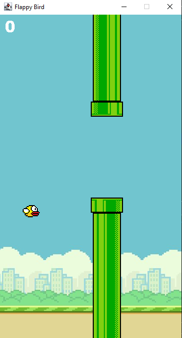
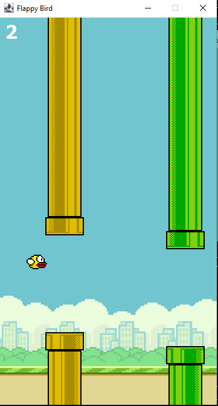
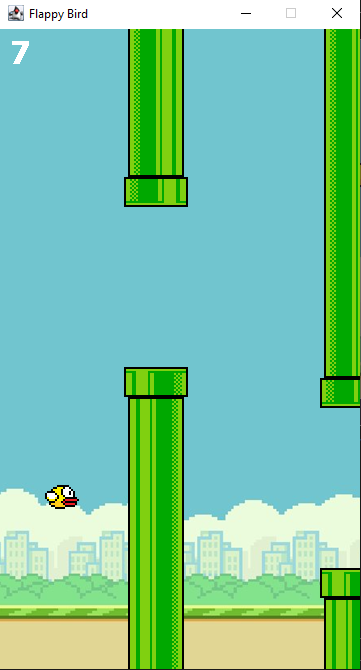
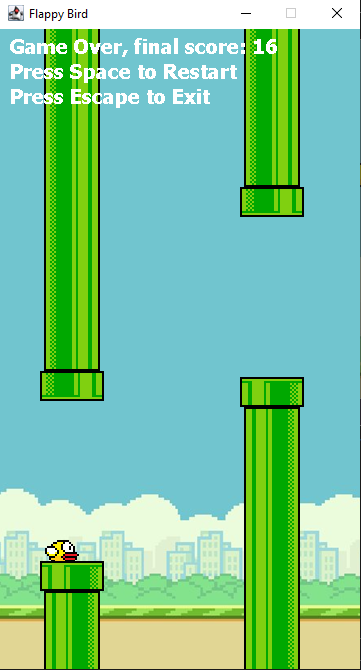

# Flappy Bird

Made a game of Flappy Bird using Java

## How to Play

- Go through the pipes!
- The regular green pipes are worth 1 point.
- Gold pipes have a 15% chance of spawning and are worth 5 points.
- Avoid hitting the pipes or the ground.
- There is no limit, get through as many pipes as you can!

## Requirements to Play

- Java JDK 8 or higher
- Any Java IDE or terminal that can run Java

## Controls
- Press **Space** to jump *and* restart after game over
- Press **Esc** to exit the game (You may exit the game at any time)

## Game features
- Procedurally generated pipes with random gaps
- Gold Pipes that give bonus score
- Gravity based movement physics
- Collision detection system
- Score tracking
- Game over + restart system

## IDE Used
IntelliJ

## Made by
Isaac Afram

## Screenshots

